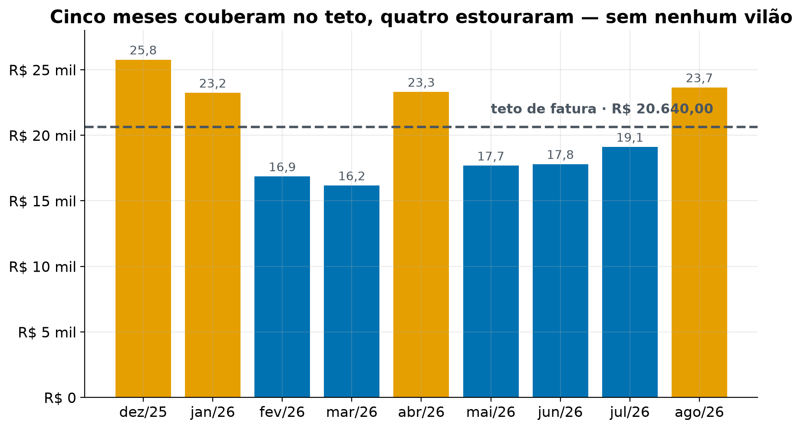

# Finanças da família — o que faz um mês estourar, e como travar isso

> **Estudo de caso com nomes fictícios.** Pessoas, estabelecimentos e cidade foram renomeados; valores, datas e o método são os da análise original. As faturas não estão no repositório.

**Pergunta de negócio:** o que separa um mês em que a fatura líquida da família fica abaixo do teto de `R$ 20.640` de um mês em que ela estoura?

**Decisão que depende disso:** onde cortar e quanto travar por mês, para o mês fechar positivo sempre.

**Muda a decisão se:** a fatura líquida mensal (sem o repasse do pai) ficar abaixo de `R$ 20.640`. Esse é o critério, em reais.

**Expectativa antes do dado:** o casal declarou **não ter hipótese prévia** sobre o que separa um mês bom de um mês ruim. Registrado para reconhecer surpresa depois.

**Público:** o casal (Orlando e Mariana).

**Dados:**
- `dados/marido/` e `dados/esposa/` — 10 faturas Nubank cada, nov/2025 a set/2026.
- `dados/PLANILHA PLANEJAMENTO FINANCEIRO - ... Mês 09_2026.csv` — contas fixas e salários, **referente a set/2026 apenas**.

**Fora do escopo:**
- Auditar o reembolso do pai da Mariana — confirmado fora do dado, não há extrato de conta corrente.
- Ordenar quitação de dívidas por custo — faltam taxa de juros e saldo devedor dos contratos.
- Adivinhar quais compras da fatura são do pai — não existe marcador; nenhuma heurística será inventada.

---

### O pedido como chegou, e a formulação acordada

O pedido chegou em `dados/PROMPT_ANALISE.md`, já com pergunta, decisão e critério definidos, além de números pré-apurados a confirmar.

Uma lacuna foi levantada e resolvida com o casal antes de codar: **as contas fixas existem só para set/2026**, mas os contadores de parcela (`CARRO 08/14`, `MERCADO PAGO 3/10`) revelam a data de início de cada uma — logo, nem todas existiam nos meses anteriores. Ficou acordado apresentar as **duas versões**: as fixas constantes em `R$ 8.860` (para confirmar a tabela do brief) e as fixas reconstruídas mês a mês pelos contadores, mostrando onde divergem.

## Resposta e evidência

## Síntese executiva

### Resposta

**O dinheiro não deixa de sobrar porque a família gasta demais — ela gasta, em média, `R$ 239` abaixo do teto. O que falta é controle da oscilação: nos quatro meses ruins o gasto sobe de forma difusa, sem que nenhuma compra chame atenção, e o mês estoura.**

O buraco de `R$ 1.604`/mês do brief **não existe como déficit estrutural** — ele era, quase inteiro, um erro de medida. Dos `R$ 25.835`/mês de fatura bruta, `R$ 5.434` (21,0%) são conta do pai da Mariana, que entra e sai; `R$ 1.696` disso são compras que o brief não tinha identificado — inclusive a conta de luz. Ele reembolsa em dia, é conta neutra, e **daqui em diante o assunto é só o gasto de vocês dois**.

O gasto próprio do casal é **`R$ 20.401`/mês contra um teto de `R$ 20.640`**. Cinco dos nove meses fecharam no azul. O problema não é o nível — é que ele oscila `R$ 9.601` entre o melhor e o pior mês.

### O que sustenta

1. **A separação da conta do pai está validada fora da amostra.** São `R$ 5.434,06`/mês (`R$ 3.738` de Pix + `R$ 1.696` de compras). O Pix bate com o valor pré-apurado (`R$ 40.819,44` contra `R$ 40.819`), e na fatura de **outubro/2026** — mês que não entrou na janela — o casal marcou à mão exatamente as **quatro origens** que a análise já classificava, deixando o `Jatobaalto Vet` sem marca. A regra reproduz fora do dado em que foi construída.
2. **O gasto próprio do casal é `R$ 20.401,40`/mês contra um teto de `R$ 20.640`** — saldo médio de `R$ 239`, e o número **melhorou cinco vezes** quando o casal identificou que a conta de luz da fatura é do pai. **Os mesmos 5 meses fecham positivos nas duas versões.**
3. **Um mês ruim não tem vilão.** São necessárias **9 categorias para explicar 80%** da diferença de `R$ 6.469`/mês, e as três maiores explicam só 47%. Independente disso, e mais forte: **a maior compra individual de agosto é 5% do mês, e a de dezembro, 6%**.
4. **É consumo novo, não parcela acumulada: 85,0% da diferença é compra à vista.** A carga parcelada é estável em torno de `R$ 4.500`/mês nos nove meses.
5. **Os meses ruins têm dois modos de falha.** Dezembro e agosto estouraram desde o dia 1 (1,33× e 1,40× nos primeiros 12 dias); janeiro e abril começaram **abaixo** do normal (0,81× e 0,84×) e estouraram depois do dia 12. Um plano que só faça uma das duas coisas cobre metade dos casos.
6. **O gasto é pulverizado, e isso é estrutural.** Os 20 maiores destinos carregam só 38,1%; a mediana de uma compra é `R$ 70,50`; são **171 compras/mês**, quase 6 por dia. 80% das compras estão abaixo de `R$ 200` e somam 45% do gasto.
7. **Não há dívida cara no cartão.** Zero juros de rotativo, zero anuidade, zero parcelamento de fatura em 11 meses. Faturado `R$ 253.830`, pago `R$ 252.571` — razão **0,995**. A fatura é quitada integral todo mês. A exceção é o **Pix no Crédito**, que embute o custo no valor transferido — ver a varredura final.
8. **A esteira de dívidas libera `R$ 5.915`/mês até mar/2028**, sendo `R$ 3.200` só entre novembro e dezembro de 2026 (`CHEQUE MARINA` e `EMPRESTIMO 34/36`). O teto de fatura sobe de `R$ 20.640` para `R$ 23.853` até mar/27 — **e cai para `R$ 15.653` em abr/27**, o piso da projeção, subindo a `R$ 17.068` só em set/27. No mês do choque a esteira já devolveu `R$ 4.500`/mês, e o choque tira `R$ 9.500`: ela **amortece, não compensa**. Sem ela o teto pós-choque seria `R$ 11.153`.
9. **A carga de parcelas cai `R$ 3.012`/mês sozinha até dez/2026** (de `R$ 3.636` em ago/26 para `R$ 624`), desde que nenhum plano novo seja assumido. É **1,5 vez o cenário médio** de corte inteiro. Medida contra a carga **média** dos nove meses (`R$ 4.588`), a queda é de `R$ 3.964` — do tamanho do agressivo.

**Quatro coisas empurram o resultado para o lado favorável e ficaram de fora por conservadorismo.**

1. **Os `R$ 20.401`/mês são um teto do consumo próprio.** O casal também faz **compras** para o pai, e uma compra dele num mercado é idêntica a uma da família na fatura. Cinco origens foram identificadas (quatro marcadas pelo casal e a conta de luz); pode haver outras sem marcador. Se houver, o gasto real do casal é menor e o saldo é melhor.
2. **A dupla contagem de energia que eu declarava não existe.** Eu tratava `R$ 193,53`/mês como energia contada dos dois lados (nas fixas e no cartão). O casal esclareceu que **a Luzforte da fatura é do pai** — o dado sustenta, ela só aparece em 5 dos 9 meses. A ressalva caiu, e o saldo médio subiu de `R$ 45` para `R$ 238,60`.
3. **O Pix do Orlando para a própria conta** (`R$ 75`/mês) é movimentação de caixa, e segue contado como consumo.
4. **A contagem de 5 meses positivos é robusta**: mantém-se em 5/9 mesmo sob hipóteses pessimistas sobre a completude da exclusão.

### O que enfraquece

- **A média de `R$ 239` não descreve nenhum mês.** O desvio é `R$ 3.574` e a amplitude é `R$ 9.601` — **40 vezes a média**. Quatro meses fecham negativos: dez/25 (`R$ -5.133`), ago/26 (`R$ -3.011`), abr/26 (`R$ -2.672`) e jan/26 (`R$ -2.605`).
- **A esteira supõe que nenhum compromisso novo entra, e o histórico diz o contrário — com folga.** Na janela o casal iniciou **63 parcelamentos novos (7/mês)**, criando `R$ 996`/mês de nova parcela mensal, mais duas dívidas fixas novas (`R$ 1.715`/mês). É por isso que o parcelado nunca caiu.
- **Agosto: não determinável.** A régua dos 12 primeiros dias não separa os grupos (bons 0,93–1,13×, ruins 0,81–1,40×). O próximo mês completo resolve. A varredura por data de corte mostra que **só o dia 25 separa** (folga `0,050`); o dia 20 não separa (`−0,040`), sobre 5 cortes testados em 9 meses — e o dia 25 deixa pouco tempo para corrigir o mês.
- **As duas bases da queda de parcela precisam ser lidas com a etiqueta:** `R$ 3.012` é de ago/26 para dez/26; `R$ 3.964` é da média dos nove meses para dez/26. Citar uma como se fosse a outra infla ou desinfla a alavanca em `R$ 950`.
- **A queda de `R$ 3.012` nas parcelas é condicional, não automática.** Ela supõe que as compras parem, não só que deixem de ser parceladas. Pagar à vista o mesmo consumo não reduz a fatura do mês.
- **`pessoa_fisica` encolheu 36% conforme o casal foi nomeando os destinos** — de `R$ 3.238` para `R$ 2.059`/mês. Sobraram **2 destinos recorrentes** (`R$ 120`/mês); 94% da categoria são pagamentos esporádicos a 156 pessoas diferentes. Nada disso era dedutível do dado: o cartão só mostra o nome. **Pode haver mais nomes a reclassificar**, e cada um move dinheiro de categoria.
- **O detector de parcelamento cancelado tem duas fragilidades declaradas** (célula do Passo 0): exige valor exato em 45 dias — estorno parcial ou tardio passa batido, e o compromisso futuro fica superestimado; e casa por destino + valor, então com dois carnês iguais no mesmo lugar a **data de término** de um deles pode sair errada.
- **A renda é tratada como constante até abr/2027** e vem do rodapé da mesma planilha de set/2026 — a mesma limitação declarada para as fixas. Com margem de `R$ 239`, **1% de variação da renda (`R$ 295`) ainda decide o sinal**, e a maior fonte (`R$ 21.000`) é plausivelmente variável.
- **`nao_classificado` é 5,7% do gasto** (`R$ 1.167`/mês) — dentro do limite, mas é dinheiro sem categoria.
- **As bases dos gastos episódicos são minúsculas:** viagem tem 4 lançamentos no período, educação 5, veículo 20, vestuário 18.
- **O teto de rotina nunca foi cumprido inteiro.** Categoria por categoria, cada teto já foi praticado; somadas, as 11 categorias de rotina nunca ficaram abaixo de `R$ 11.617` num mês (mar/26), e a média dos meses bons foi `R$ 12.026` — `R$ 645` acima dos `R$ 11.381`. Os 4 meses que couberam no limite do cartão couberam porque o gasto eventual foi baixo. A folga de `R$ 2.425`/mês absorve a diferença, mas a rotina pede um mês melhor que o melhor já vivido.
- **A média dos 9 meses tem `R$ 2.518`/mês de parcela que já morreu.** Dos `R$ 4.558`/mês de carnê medidos (a média com estornos, `R$ 4.588`, é a usada nos cenários), 55% vêm de **53 planos encerrados antes de ago/26** — o notebook do `SUSITA CORREIA` (`R$ 233`/mês, 7 parcelas seguidas) é só o maior. Isso não afeta a projeção (que só conta plano vivo), mas **inflava a base do orçamento por categoria**, que foi refeito sobre o gasto à vista. Foi o casal que apontou: *"essas parcelas já acabaram, precisa validar essas coisas"*.
- **O orçamento por categoria é de consumo À VISTA**, e a parcela viva (`R$ 3.636`/mês em ago/26) cai **por fora** dele, indo a zero até set/27. Conferir as duas linhas juntas contra o limite de `R$ 12.981` daria a impressão errada de estouro.
- **O Pix no Crédito tem custo embutido — estimado, não medido.** A fatura não mostra tarifa, mas só 3% dos Pix no Crédito terminam em reais redondos (contra 31% das outras compras), e um reembolso devolveu 8,7% a menos que o valor pago. Nos Pix do casal isso vale entre `R$ 18` e `R$ 77`/mês; o valor exato de cada um está no app.
- **Os contadores de parcela das fixas vêm da planilha, e um deles estava errado por quatro parcelas.** O casal corrigiu o empréstimo (`20/36` → `24/35`); os outros quatro não foram conferidos e definem o calendário inteiro da esteira.

### O que fazer

**Semana 1 — o que custa uma conversa e destrava todo o resto**
1. **Cartão virtual dedicado ao pai — e o motivo não é o dinheiro dele, é enxergar o de vocês.** Ele paga em dia e isso não está em questão. O problema é que `R$ 5.434`/mês se misturam à sua fatura e **impedem vocês de saber quanto gastaram**. 99% da conta dele está no cartão da Mariana, cuja fatura bruta roda `R$ 14.803`/mês — sem separar, mesmo o teto **familiar** só é conferível somando as duas faturas e subtraindo o repasse à mão, todo mês.
2. **Corrigir os quatro erros da planilha** (teto rotulado como saldo, os dois Nubank em zero, o contador do empréstimo, caridade em zero), criar as duas linhas que faltam e **conferir os outros quatro contadores de parcela no aplicativo**.

**Mês 1 — travar a oscilação, que é o problema real**
3. **Teto FAMILIAR de `R$ 12.981`/mês no cartão** — `R$ 11.381` para as 11 categorias que caem todo mês (dos quais `R$ 1.448` de pagamentos a pessoas, decisão do casal em out/26) e um **fundo de emergência** de `R$ 1.600` para o que é eventual (decisão do casal: um número só, sem dividir por pessoa), com conferência **semanal** das quatro categorias de decisão diária — mercado, combustível, delivery e farmácia — em **`R$ 1.559`/semana** (`R$ 6.750`/mês à vista, contra `R$ 7.696` hoje — corte de 12%). **Os quatro tetos desse bloco foram escolhidos pelo casal**: mercado `R$ 4.050` (`R$ 3.900` + `R$ 150` de botijão de gás e água de 20 L), combustível `R$ 1.300`, delivery `R$ 900`, farmácia `R$ 500`. E uma conferência do total **no dia 25** — testei cinco cortes, e **essa é a única data que separa mês bom de mês ruim** (folga `0,050`). O dia 20 chega perto e **não** separa (`−0,040`); dias 10, 12 e 15 não servem. O teto declarado *antes* do mês é o que pega dezembro e agosto, que estouram desde o dia 1.
4. **Assinaturas: ficam como estão, e o plano já conta com isso.** Ativas hoje: `R$ 893,60`/mês em assinaturas digitais e `R$ 492,06` em internet e celular (Starlink, Vivo, Claro), já sem o Wellhub de `R$ 149,99`, o Resend, o Panda Video e o Google One de `R$ 14,99`, que o casal cancelou, e já com a Vivo do Orlando em `R$ 204,70`. O limite do grupo automático (`R$ 1.400`) cobre os dois no preço de hoje, com folga de `R$ 14`. **Cancelar ou renegociar é opcional:** cada real a menos vira sobra. A maior da lista é a assinatura Claude/Anthropic, `R$ 570,52`.
5. **O corte vem do orçamento, não de um cenário.** Os cenários (leve `R$ 1.104`, médio `R$ 2.020`, agressivo `R$ 3.885`/mês) mediram o tamanho do esforço; o que vale é o orçamento por categoria — `R$ 2.832`/mês a menos no consumo à vista, entre o médio e o agressivo.

**Trimestre — a ação de maior impacto, e a que o histórico mostra falhando**
6. **Não comprar nada parcelado até dezembro.** Duas coisas chegam sozinhas: `R$ 3.200`/mês de dívida fixa vencendo (nov e dez) e `R$ 3.012`/mês de queda na carga de parcelas do cartão. Juntas são `R$ 6.212`/mês — mais que qualquer cenário de corte. **Mas "não parcelar" tem que significar "não comprar"** — trocar dez parcelas por um pagamento à vista não reduz a fatura do mês, piora. Ao ritmo medido de `R$ 996`/mês de nova parcela criada, **três meses de compras parceladas consomem os `R$ 3.012`**, e foi exatamente isso que travou o parcelado em `R$ 4.588`/mês nos nove meses analisados.
7. **Nenhum nível de corte substitui a condição.** Em dez/26, ainda com a renda cheia, até o corte agressivo aguenta continuar parcelando. Depois do choque, não: o agressivo sem parar de parcelar fica com média de `R$ 100`/mês e **5 de 12 meses no vermelho**; o orçamento inteiro sem parar de parcelar, **12 de 12**.

**Antes de abril/2027 — o choque de renda**
8. **Adotar já o orçamento da renda nova.** `R$ 12.981`/mês de cartão é o número dimensionado para `R$ 20.000` de renda (`R$ 20.000` − `R$ 2.932` de fixas − `R$ 4.087` de sobra); adotá-lo agora transforma os seis meses de renda cheia em `R$ 55.208` de reserva e elimina a transição. Depois do choque, o plano sobra `R$ 3.573`/mês em média, nenhum mês negativo, e `R$ 4.087`/mês a partir de set/27.
9. **Em março de 2027, quitar o `EMPRESTIMO` de `R$ 1.000`/mês.** Custa no máximo `R$ 6.000` nessa data (não `R$ 5.000`, que é o custo em abril, nem `R$ 11.000`, que é hoje). Peça o saldo devedor ao banco — com desconto de juros vem menor. **Não antecipe parcela de cartão:** 87% dela vence sozinha antes de abril, e o que sobra são `R$ 749` em três planos de curso.

**O que a varredura final achou nas faturas**
10. **Google One em dobro — resolvido.** O de `R$ 14,99` (cartão da Mariana) foi cancelado em set/26; o de `R$ 49,99`, com compartilhamento familiar, fica. `R$ 180`/ano a menos.
11. **Pix para pessoas pela conta, não pelo crédito; empresa, no cartão direto.** O Pix no Crédito embute custo que a fatura não mostra.
12. **Três suspeitas conferidas pelo casal, nenhuma é erro:** o Wellhub de `R$ 149,99` de 05/09/26 foi a última cobrança antes do cancelamento; os dois carnês da Asimov são dois cursos diferentes; e a Conta Vivo de `R$ 75` no cartão era a linha do Orlando, enquanto o `VIVO` da planilha é a da Mariana, paga fora do cartão — não há conta dupla. Depois disso as duas mudaram: a do Orlando está em `R$ 204,70` e a da Mariana em `R$ 62`.

**O que falta pedir**
- **Contratos das cinco dívidas** — taxa de juros e saldo devedor. Sem eles não dá para ordenar a quitação por custo nem dizer se vale antecipar alguma.
- **A fatura de setembro fechada** — é o que decide se agosto foi evento ou base nova.
- **Extrato da conta corrente** — só se quiserem verificar se há tarifa de Pix no Crédito, que a fatura não mostra. Não é necessário para nada do plano.

### O que não foi investigado

A composição de `nao_classificado` (105 destinos, `R$ 1.167`/mês). O vínculo e a substituibilidade dos prestadores recorrentes de pessoa física. Sazonalidade anual: com 9 meses não há como separar "dezembro é caro todo ano" de "dezembro de 2025 foi caro". Os outros Pix para parentes (`R$ 1.948` no período) ficaram como gasto do casal por decisão deles. E quanto do consumo restante ainda é compra do pai — não determinável sem marcador, mas o erro possível é a favor: se houver, o gasto de vocês é menor.

### O critério do brief, fechado na unidade dele

O critério era **fatura líquida ≤ `R$ 20.640`/mês**, medindo só o gasto de vocês. Resultado: média de `R$ 20.401,40`, **`R$ 239` abaixo do teto** — atendido na média, e em 5 dos 9 meses. Mas atendido por **0,2% do teto**, sobre uma série cuja amplitude é `R$ 9.601`. Na prática, o critério **não está atendido de forma confiável**: quatro meses estouraram.

Recomendo revisar o próprio critério: um limiar colado no valor medido é o pior lugar para a régua. O critério útil aqui não é a média e sim a **frequência** — por exemplo, "no máximo um mês por ano acima de `R$ 20.640`". Por esse critério a resposta hoje é **não atendido** (quatro estouros em nove meses), e o plano acima é o que o atende.

**E o critério mudou de patamar em abril de 2027.** Com a renda em `R$ 20.000`, o teto de fatura deixa de ser `R$ 20.640` e passa a ser `R$ 17.068` (renda menos as fixas de `R$ 2.932`) — e para guardar 15%, `R$ 14.068`. O plano vai além: `R$ 12.981` no cartão, que guarda `R$ 4.087`/mês (20% da renda nova) — e é adotado desde outubro.

## Orçamento: duas réguas, porque nem todo gasto é do mês

Até aqui a análise disse **quanto** cortar. Esta seção diz **onde** e, principalmente, **como lançar** — porque um orçamento que não dá para usar no caixa do supermercado não é orçamento.

**A lógica da proposta:** o orçamento é dimensionado para a renda **depois** do choque (`R$ 20.000`), não para a de hoje. Adotar em outubro o orçamento que vai ser necessário em abril tem três vantagens sobre esperar: não existe transição (em abril nada muda no dia a dia), os seis meses de renda cheia viram poupança pura, e dá tempo de ajustar se o número não funcionar na prática.

### A mudança que o casal pediu, e por que ela é certa

> *"casa construção não é direto isso... fazenda também só às vezes... viagem não tem isso... carro vou usar da reserva quando precisar. Muitas coisas que vez surge preciso usar da reserva."*

Estava certo, e o problema é maior do que parece: **dar linha mensal para uma despesa que acontece duas vezes por ano é orçar por média — e a média não descreve nenhum mês.** Nos dez meses em que a viagem não acontece, aquele dinheiro fica disponível para virar outra coisa.

Então o orçamento passou a ter **duas réguas**:

- **ROTINA** — o que cai todo mês. Tem teto mensal e conferência semanal.
- **EVENTO** — o que acontece de vez em quando. **Não tem teto mensal**: tem um **fundo de emergência** que recebe um valor fixo por mês e **acumula** enquanto nada acontece.

### Quem é rotina e quem é evento — medido, não opinado

Uma categoria é **rotina** se cumprir as três condições:

1. aparece em **8 ou mais** dos 9 meses;
2. **nenhum mês concentra mais de 30%** do que ela gastou no período;
3. **é fluxo de verdade** — ou tem fornecedor que se repete em 5+ meses, ou tem 10+ lançamentos por mês.

A segunda condição é o que separa `restaurante_delivery` (39 lugares diferentes, mas todo mês, mês mais pesado = 15%) de `casa_construcao` (11 lojas, nenhuma repetida, mês mais pesado = 37%): as duas têm fornecedor variado, só uma é rotina. A terceira derrubou `outros_compras`, que passava nas duas primeiras sendo um saco de compras avulsas — 24 destinos, **nenhum** recorrente, e o mês varia de `R$ 0` a `R$ 1.186`.

> **Uma correção de dado que a regra expôs.** O mesmo pet shop aparecia com **sete grafias** (`REDE VEREDACERRADO LAGOAJATOBA`, `BARRAMANGAL`, `CAPPTA *REDE VEREDACERRADO PET C`, `TRADIO *REDE VEREDACERRADO SERRANOVO`…). Separadas, nenhuma parecia fornecedor recorrente e o `pet` caía como evento — o que contradiz o casal, que compra ração todo mês. Unidas pelo apelido, a categoria passa na regra sozinha. **O erro não estava na regra, estava no nome.**

### Como cada teto foi calculado

1. **Piso contratual** — só conta de valor contratado: `utilidades` (Starlink, Vivo, Claro) fica no **preço de hoje**, `R$ 492,06`/mês — a Vivo do Orlando caiu para `R$ 204,70` em out/26. A luz saiu, é do pai; o gás e a água de 20 L foram para mercado.
2. **Piso de realidade** — nenhum teto abaixo do menor mês à vista já observado. Teto que a família nunca atingiu nem uma vez em nove meses não é orçamento.
3. **O teto de cada categoria de rotina é o que vocês gastaram nos cinco meses bons** (fev, mar, mai, jun, jul/26) — nível já praticado, não hipótese.
4. **Onde vocês escolheram o número, o número de vocês manda:** mercado `R$ 4.050` (`R$ 3.900` + `R$ 150` de gás e água), combustível `R$ 1.300`, delivery `R$ 900`, farmácia `R$ 500`.
5. **O fundo de emergência é escolha, e é a mais dura do plano.** A célula imprime a tabela de sensibilidade — quanto pôr no fundo, quanto sobra de poupança, e quanto isso exige de corte no gasto eventual.

**Não existe mais rateio proporcional, e essa é a diferença que importa:** no desenho anterior o total do cartão era fixado antes e as categorias se espremiam dentro dele — apertar uma não fazia sobrar mais dinheiro, só afrouxava outra. Agora **o total é a soma dos tetos, e o que sobra da renda vira poupança**. Cortar em qualquer lugar aparece na poupança no mesmo mês.


### Afrouxar é possível — e agora o preço aparece

A pergunta que o casal levantou continua valendo: *combustível não é escolha livre, "vou muito pra fazenda"*. A resposta ficou mais simples de dar, porque no desenho novo **subir um teto não tira de outra categoria: sai da poupança**.

A tabela abaixo mostra o preço de afrouxar as duas maiores. E o limite: a poupança do plano é `R$ 4.087`/mês (20% da renda nova) contra um mínimo aceito de `R$ 3.000` (15%) — **cabe afrouxar até `R$ 1.087`/mês** sem furar esse piso.


**Resultado: categoria por categoria, nenhum teto de rotina pede um nível que a família nunca praticou — mas, somadas, as categorias de rotina nunca couberam inteiras.** O teste de exequibilidade não devolveu nenhuma linha com teto atingido em 0 ou 1 dos 9 meses, e nenhuma leva corte de 50% ou mais — as que levavam eram justamente as episódicas, que agora não têm teto mensal.

**O limite da soma é mais duro que o de cada linha.** As 11 categorias de rotina nunca somaram menos de `R$ 11.617` num mês (mar/26), e nos meses bons a média foi `R$ 12.026` — `R$ 645` acima do teto de `R$ 11.381`. Os quatro meses que couberam no limite do cartão couberam porque o gasto eventual foi baixo neles. A folga de `R$ 2.425`/mês do plano absorve essa diferença, mas é honesto dizer: cumprir a rotina inteira pede um mês melhor que o melhor já vivido.

As linhas apertadas são quatro: **pessoa física** (`−R$ 503`, −26%), **mercado** (`−R$ 441`, teto do casal), **assinaturas digitais** (`−R$ 307`, −25%, contra a média dos nove meses — as ativas hoje cabem) e **não classificado** (`−R$ 270`, −28%). As duas primeiras e a terceira concentram o esforço — e duas delas são justamente os sacos pretos, apertados de propósito abaixo do nível dos meses bons.

**O fundo de emergência é o ponto frágil, e é honesto dizer.** Ele recebe `R$ 1.600`/mês contra `R$ 2.311`/mês de gasto eventual medido — um corte de 31%. Cobriu 4 dos 9 meses; no mês mais pesado faltariam `R$ 2.426`. Como ele **acumula**, o que importa não é o mês e sim o ano: a `R$ 1.600`/mês ele fecha 12 meses com `R$ 8.536` a menos do que o gasto histórico pediria. Ou o gasto eventual cai 31%, ou o fundo precisa ser maior — e a tabela de sensibilidade mostra exatamente quanto isso custa de poupança.


**Resultado: `R$ 12.981`/mês no cartão — `R$ 11.381` de rotina mais um fundo de emergência de `R$ 1.600` para o que é eventual — e `R$ 4.087`/mês de poupança, 20% da renda nova.**

| destino da renda, depois do choque | por mês |
|---|---|
| contas fixas | `R$ 2.932` |
| **cartão · ROTINA** (11 categorias que caem todo mês) | **`R$ 11.381`** |
| **cartão · FUNDO DE EMERGÊNCIA** (11 categorias, sai quando acontece) | **`R$ 1.600`** |
| **POUPANÇA** | **`R$ 4.087`** |
| renda | `R$ 20.000` |

Contra o gasto de hoje: à vista a família gasta `R$ 15.813`/mês, o orçamento pede `R$ 12.981` — **`R$ 2.832` a menos, 18%**. Nos cinco meses bons o gasto à vista foi `R$ 13.370`: o orçamento está `R$ 389` **abaixo** da média dos cinco meses bons.

> **As parcelas caem POR FORA deste teto.** Em ago/26 são `R$ 3.636`/mês de carnê ainda vivo, que somam ao consumo à vista na fatura e vão a **zero até set/2027**. O extrato mês a mês trata as duas linhas separadas, e é assim que elas devem ser conferidas.

### O que a tabela não mostra

> **A tabela completa não é repetida aqui de propósito.** Ela é a saída da célula do orçamento, e está no painel com uma coluna explicando o que é cada categoria. Reproduzi-la em texto foi o que mais gerou número desatualizado nesta análise. **A que vale é a calculada.**

**Quatro tetos foram escolhidos pelo casal, não pela conta:** mercado `R$ 4.050` (`R$ 3.900` + `R$ 150` de gás e água), combustível `R$ 1.300`, delivery `R$ 900`, farmácia `R$ 500`. Somam `R$ 6.750` — e os quatro estão abaixo do que a própria família gastou nos meses bons (`R$ 7.075`).

**Dois tetos foram apertados de propósito, abaixo do nível dos meses bons:** `pessoa_fisica` (`R$ 1.517` → `R$ 1.300`, hoje `R$ 1.448` com o que as contas baixaram) e `nao_classificado` (`R$ 821` → `R$ 700`). Juntas são `R$ 2.921`/mês espalhados em **mais de 200 destinos que aparecem uma única vez**. É a parte menos prestável de contas do orçamento, e apertá-la não piorou a exequibilidade: `pessoa_fisica` cabe em 3 dos 9 meses tanto a `R$ 1.517` quanto a `R$ 1.300`.

**Duas linhas de rotina não são cortadas, por motivos diferentes:**

- **`utilidades`** (`R$ 500`) fica no preço de hoje: Starlink `R$ 249`, Vivo `R$ 204,70` e Claro `R$ 38,36` — `R$ 492,06`, arredondado para cima em `R$ 10`.
- **`servico_domestico`** sobe `R$ 31`: nos meses bons vocês gastaram mais com faxina do que na média, e o teto segue o nível praticado.

**`assinaturas_digitais` fica em `R$ 900`, e cobre todas as assinaturas ativas hoje** (`R$ 893,60`, já sem o Wellhub de `R$ 149,99`, o Resend, o Panda Video e o Google One de `R$ 14,99`). O plano não depende de cancelar mais nada. A média de `R$ 1.207` dos nove meses é maior porque inclui as ferramentas compradas e abandonadas; o teto deixa `R$ 6` de folga, não espaço para ferramenta nova.

**O que as contas baixaram virou limite de pagamentos a pessoas**, a pedido do casal: o Panda Video cancelado, a Vivo do Orlando de `R$ 225,66` para `R$ 204,70` e a da Mariana (fora do cartão) de `R$ 75` para `R$ 62` liberaram `R$ 148`/mês, que foram para `pessoa_fisica` — a linha mais apertada do orçamento. O teto do cartão sobe de `R$ 12.968` para `R$ 12.981` (os `R$ 13` que a conta fora do cartão liberou), e a sobra de cada mês fica igual.

### O teto é familiar, um número só — e a regra semanal que o torna conferível

**Decisão do casal: o teto é da família, sem divisão por pessoa.** O teto por pessoa dependia do cartão virtual do pai existir (a fatura da Mariana carrega `R$ 5.353`/mês que não são dela); um teto único da casa vocês já conseguem conferir hoje, somando as duas faturas.

Mas um número mensal só é conferível no fim do mês, quando já não dá para corrigir. A ponte é olhar **as quatro categorias que se decidem todo dia** — mercado, combustível, delivery e farmácia:

> **`R$ 6.750`/mês · `R$ 1.559` por semana · `R$ 225` por dia**, para a casa inteira.

Hoje essas quatro somam `R$ 7.696`/mês à vista, ou `R$ 1.777`/semana. **É um corte de 12%** — e é a conferência que substitui a planilha: se a semana fechou acima de `R$ 1.559`, o mês vai apertar, e ainda há três semanas para corrigir.

**Os outros bolsos têm ritmo próprio, e nenhum precisa de conferência semanal:** a *rotina do mês* (faxina, unha, academia, ração, pagamentos a pessoas) se decide uma vez; o *automático* (assinaturas e contas em débito) nem isso — se decide cancelando ou renegociando; e o *fundo de emergência* se controla na hora de decidir a compra, que é quando a decisão existe de verdade.

### O que este orçamento entrega

A partir de setembro/2027, quando a última dívida fixa acaba, ele guarda **`R$ 4.087`/mês — 20% da renda nova**, contra os 15% que o desenho anterior entregava. Enquanto a renda ainda for `R$ 29.500`, guarda muito mais, e sobe conforme as dívidas vencem — **o extrato mês a mês, adiante, traz cada mês já com as parcelas antigas descontadas**: `R$ 6.047` em out/26, `R$ 10.289` em mar/27, `R$ 55.208` guardados antes de a renda cair.

> **Uma ressalva sobre a divisão por categoria.** Cada teto de rotina é o nível dos meses bons daquela categoria. É um ponto de partida defensável, não uma verdade: se para vocês faz mais sentido cortar um pouco mais em mercado e um pouco menos em pagamentos a pessoas, **o total é o que importa**. E, diferente do desenho anterior, cortar de verdade em qualquer linha agora aparece na poupança — não é redistribuído para outra categoria.


## Quanto dá para GUARDAR, e a partir de quando

O brief pedia fechar o buraco. O casal pediu mais: **guardar dinheiro**. É outra pergunta e merece outra conta.

Há um motivo para otimismo e um para cautela, e os dois já foram medidos. O otimismo: **`R$ 5.915`/mês de conta fixa vencem sozinhos até mar/2028**, e esse dinheiro aparece sem ninguém fazer nada. A cautela: **o choque de abr/27 consome `R$ 9.500` disso** — como o Passo 6 mostrou, a esteira amortece mas não compensa. A única pergunta é se ele vai ser **guardado** ou **reabsorvido** — e o histórico de 63 parcelamentos novos em 9 meses diz qual dos dois acontece por inércia.

Projeção mês a mês, de out/2026 a mar/2028, **já com a queda de renda de abr/2027 aplicada**:

`sobra = renda do mês − fixas do mês − (gasto à vista − corte) − parcela do mês`

> **Uma correção que a revisão pegou, e ela era grande.** A primeira versão desta projeção usava a renda de `R$ 29.500` nos dezoito meses. Como doze deles são posteriores ao choque, cada cenário saía inflado em `12 × R$ 9.500 = R$ 114.000` — e esse número chegou a ser publicado no painel. O choque é informação que o casal deu no começo: projetar sem ele não é conservadorismo, é erro.

Cinco cenários. Em todos, "parar" significa **parar de comprar parcelado**, não trocar parcela por pagamento à vista.

**Resultado: a decisão que vale mais não é cortar mercado — é parar de parcelar.**

Todos os cenários abaixo já trazem a queda de renda de abr/2027. O **D é o plano**: o orçamento definido pelo casal (`R$ 12.981`/mês de cartão) mais não comprar parcelado.

| cenário | guardado em 18 meses | média por mês |
|---|---|---|
| A) se nada mudar | `R$ -62.391` | `R$ -3.466` |
| B) só parar de parcelar, sem cortar nada | **`R$ 47.110`** | `R$ 2.617` |
| C) parar + corte leve | `R$ 66.973` | `R$ 3.721` |
| **D) parar + o ORÇAMENTO (o plano)** | **`R$ 98.088`** | **`R$ 5.449`** |
| E) parar + corte agressivo | `R$ 117.033` | `R$ 6.502` |

**Olhe o salto de A para B: `R$ 109.501`, e B não corta uma única categoria.** É a diferença entre terminar março de 2028 devendo e terminar com dinheiro guardado — e ela vem só de não comprar parcelado. O salto de B para C, que é o corte leve inteiro, vale `R$ 20.051`: **a alavanca do parcelamento é 5,5 vezes a do corte leve.**

**Por que isso acontece.** Parcelar não deixa o gasto mais barato — deixa a *decisão* mais barata. Nos nove meses medidos o casal assumiu `R$ 4.567`/mês de compromisso novo parcelado, mas sentiu só `R$ 996`/mês na fatura do mês. É por isso que a carga de parcelas ficou travada em torno de `R$ 4.588`/mês: as parcelas vencem e são repostas na mesma velocidade.

**E o que "parar de parcelar" quer dizer:** não comprar o que seria parcelado. Trocar dez parcelas por um pagamento à vista não reduz a fatura do mês — piora.

A média mensal esconde a forma da curva: no plano, a sobra é `R$ 6.047` em out/26, passa de `R$ 10.200`/mês de dezembro a março, cai para `R$ 2.443` em abril/2027 com a renda nova e se estabiliza em `R$ 4.087`/mês a partir de setembro/2027. O extrato mês a mês, adiante, mostra cada linha.


## O choque de abril/2027: a renda cai `R$ 9.500`

Informação nova e decisiva, dada pelo casal: **em abril de 2027 o salário da Mariana cai `R$ 9.500`**. A renda familiar vai de `R$ 29.500` para **`R$ 20.000`** — uma queda de 32%.

Isso reescreve o problema. Até aqui a pergunta era como fechar o mês com `R$ 29.500`; a partir de abr/2027 é como fechar com `R$ 20.000`. E há uma coincidência favorável: **abril/2027 é justamente quando o carro termina** (`R$ 1.300`) e o Mercado Pago paga a última parcela (`R$ 415`).

Três perguntas, nesta ordem:

1. **Como fica o mês a partir de abr/2027**, em cada cenário?
2. **Quanto dá para acumular até março/2027** — os 6 meses de folga que existem antes do choque?
3. **O que vale quitar com esse dinheiro**, para reduzir a obrigação fixa *antes* da renda cair?

> ⚠️ **Limite declarado, e é sério para a pergunta 3:** não temos os contratos das dívidas, então **não sabemos a taxa de juros nem o saldo devedor**. A soma das parcelas restantes **não é** o custo de quitar — por lei a quitação antecipada dá desconto proporcional dos juros, e o valor real é menor. Tudo que a análise pode dizer é **quanto de obrigação mensal cada quitação elimina** e **qual é o teto do custo** (a soma nominal). O número exato exige pedir o saldo devedor ao banco.

**Resultado: abril/2027 é administrável, mas só com a decisão tomada antes. Sem mudar nada, é insolvência.**

Com a renda em `R$ 20.000`, nos doze meses de abr/27 a mar/28:

| caminho | sobra média/mês | meses no vermelho | pior mês |
|---|---|---|---|
| A) se nada mudar | `R$ -6.167` | **12 de 12** | `R$ -6.763` |
| B) só parar de parcelar | `R$ 741` | 1 de 12 | `R$ -389` |
| C) parar + corte leve | `R$ 1.845` | 0 de 12 | `R$ 715` |
| **D) o plano** | **`R$ 3.573`** | **0 de 12** | **`R$ 2.443`** |
| E) parar + corte agressivo | `R$ 4.626` | 0 de 12 | `R$ 3.496` |

**Mantendo o comportamento atual, todo mês depois do choque fecha negativo.** Não é um mês ruim: é o padrão inteiro virando. E a folga para se preparar só existe antes — nos seis meses de out/26 a mar/27, com a renda ainda cheia:

| caminho | guardado até mar/27 |
|---|---|
| A) se nada mudar | `R$ 11.608` |
| B) só parar de parcelar | `R$ 38.215` |
| C) parar + corte leve | `R$ 44.836` |
| **D) o plano** | **`R$ 55.208`** |
| E) parar + corte agressivo | `R$ 61.523` |

### O que quitar, e quando

Em abril/2027 só duas dívidas fixas ainda correm: o **empréstimo de `R$ 1.000`** (última parcela em ago/2027) e o **Mercado Pago** (`R$ 415`, e abril é a última — não faz sentido quitar). Parcelas de cartão depois de abril: só `R$ 749` no total, se pararem de parcelar agora.

> **Duas contagens que parecem discordar e não discordam.** A tabela de contas fixas do Passo 7 mostra `R$ 12.000` a pagar nesse empréstimo, porque conta a partir de **set/26**, o mês a que a planilha se refere. A tabela abaixo conta a partir de **out/26**, o primeiro mês projetado. É a mesma dívida, uma parcela de diferença.

| quitando em | parcelas restantes | custo nominal (teto) |
|---|---|---|
| out/26 (agora) | 11 | `R$ 11.000` |
| dez/26 | 9 | `R$ 9.000` |
| **mar/27** | **6** (uma delas já paga no mês) | **`R$ 6.000`** — desembolso extra `R$ 5.000` |
| abr/27 | 5 | `R$ 5.000` |

Como o nominal é 1:1 (paga `R$ 1.000` para não pagar `R$ 1.000`), **quitar cedo não dá vantagem financeira** — só antecipa a saída de caixa. **O momento certo é março de 2027:** custa menos, o dinheiro rende até lá, e o alívio de `R$ 1.000`/mês cai nos cinco meses seguintes à queda de renda. No plano, abril passa de `R$ 2.443` para `R$ 3.443` de sobra.

Os `R$ 55.208` guardados até março **já incluem a parcela de março**, então a quitação custa no máximo mais `R$ 5.000`: restam **`R$ 50.208` de reserva** — três meses de toda a despesa da casa (contas fixas e cartão) na renda nova.


## É possível de verdade? A margem de erro do plano

O casal pediu isto para fechar: *"quero uma análise honesta se realmente é possível fazer o que foi sugerido — sobrar dinheiro e não ficar no vermelho, mesmo quando entrar o choque."*

Responder "sim" não é honesto, porque todo plano fecha no papel. O que responde é **quanto pode dar errado antes de ele falhar** — e isso se mede simulando o plano com cada premissa quebrada, uma de cada vez.

Duas alavancas podem falhar, e elas são independentes: **cumprir o teto** (não estourar o orçamento) e **parar de parcelar** (não criar compromisso novo). A simulação abaixo quebra cada uma, e as duas juntas.

**Resultado: é possível — e com folga. Mas o plano inteiro se apoia numa única condição, e é justamente a que o histórico nunca cumpriu.**

O casal fez a pergunta certa para fechar: *é realmente possível sobrar dinheiro e não ficar no vermelho, mesmo depois do choque?* Um "sim" não responde. O que responde é **quanto pode dar errado antes de falhar**. Tudo abaixo parte do **plano** — o orçamento de `R$ 12.981`/mês e não parcelar — nos doze meses depois do choque.

### O plano aguenta bastante — se a condição for cumprida

| e se… | sobra média/mês | meses no vermelho | pior mês |
|---|---|---|---|
| **o plano como está** | **`R$ 3.573`** | **0 de 12** | `R$ 2.443` |
| gastar `R$ 500`/mês acima do teto | `R$ 3.073` | 0 de 12 | `R$ 1.943` |
| gastar `R$ 1.000`/mês acima do teto | `R$ 2.573` | 0 de 12 | `R$ 1.443` |
| cumprir só **metade** do corte | `R$ 2.157` | 0 de 12 | `R$ 1.027` |
| as 5 dívidas fixas **2 parcelas atrás** do que a planilha diz | `R$ 3.121` | 0 de 12 | `R$ 1.143` |
| parar só **metade** do parcelamento | `R$ 1.310` | 0 de 12 | `R$ 263` |
| não cortar **nada**, só parar de parcelar | `R$ 741` | 1 de 12 | `R$ -389` |

**Dá para gastar `R$ 2.425`/mês acima do teto e nenhum mês fecha negativo.** E cumprindo só metade do corte, o plano ainda passa. A linha das dívidas responde a uma dúvida legítima: os contadores vêm da planilha, e esta análise já pegou um errado (o empréstimo lançado como `20/36` era `24/35`). Mesmo com os cinco duas parcelas atrasados, nenhum mês vira.

### Mas quando o parcelamento volta, o quadro vira

| e se… | sobra média/mês | meses no vermelho |
|---|---|---|
| cumprir o **orçamento inteiro**, mas **continuar parcelando** | `R$ -953` | **12 de 12** |
| corte **agressivo**, mas continuar parcelando | `R$ 100` | 5 de 12 |
| metade do corte + metade do parcelamento | `R$ -106` | 5 de 12 |

**Compare as pontas.** Cumprir cada teto do orçamento e continuar parcelando deixa **os doze meses no vermelho**. Não cortar nada e só parar de parcelar deixa **um**. A alavanca não é o corte.

| disciplina com o parcelamento | quanto ainda dá para gastar acima do teto, por mês |
|---|---|
| parar **100%** | `R$ 2.425` |
| parar **75%** | `R$ 1.350` |
| parar **50%** | `R$ 250` |
| não parar | já fica negativo |

### A resposta honesta

**Sim, é possível, e com folga confortável — sob uma condição que nunca aconteceu nos nove meses medidos.** Foram **63 parcelamentos novos, e zero meses sem nenhum.**

Três coisas jogam a favor, e não são pequenas:

1. **O limite do cartão já foi praticado.** 4 dos 9 meses medidos couberam nos `R$ 12.981` de gasto à vista — porque o gasto eventual foi baixo neles; a rotina sozinha nunca coube nos `R$ 11.381`.
2. **Quatro tetos foram escolhidos pelo próprio casal** — mercado, combustível, delivery e farmácia.
3. **`R$ 5.915`/mês de dívida fixa vencem sozinhos** até set/27, e `R$ 3.200` disso chega já em novembro e dezembro.

E três que jogam contra:

1. **A condição principal tem 0 de 9.** É o fato mais importante desta seção.
2. **O fundo de emergência pede 31% a menos** no que hoje se gasta com casa, fazenda, roupa e compras avulsas.
3. **Hoje vocês não conseguem conferir o próprio gasto no aplicativo**, porque `R$ 5.434`/mês do pai se misturam à fatura da Mariana — é por isso que o cartão virtual é o item 1.

> **Uma coisa que esta seção NÃO simula: inflação.** O cartão fica congelado em `R$ 12.981` nominais por 18 meses. A 4–5% ao ano, o mesmo consumo custa entre `R$ 790` e `R$ 990`/mês a mais em mar/2028 — cerca de um terço da folga de `R$ 2.425`. Não muda o sinal de nenhum mês, mas o teto precisa ser revisto no meio do caminho.

**O que isso significa em decisão:** não trate "não parcelar" como uma das recomendações. É a única de que as outras dependem.


## Extrato mês a mês: o que sobra em cada mês, seguindo o plano

A tabela abaixo é o calendário completo, de out/2026 a mar/2028. Para cada mês: quanto entra, quanto sai de conta fixa, quanto de parcela antiga do cartão, quanto de cartão, o que sobra e quanto já está guardado — **e o que vence naquele mês**.

Dois caminhos lado a lado, porque a diferença entre eles é o plano inteiro:

- **O plano** — o orçamento de `R$ 12.981`/mês no cartão e **não comprar parcelado**.
- **Nada muda** — o comportamento medido nos nove meses, projetado: parcela reposta no mesmo ritmo e dívida fixa nova entrando a `R$ 191`/mês.


**Resultado: os dois caminhos se separam em outubro e nunca mais se encontram.**

**No plano**, a sobra abre em degraus — cada degrau é uma dívida terminando:

- **out/26** — acaba o cheque especial. Sobra `R$ 6.047`.
- **nov/26** — acaba o empréstimo de `R$ 1.900`. Sobra `R$ 8.045`.
- **dez/26 a mar/27** — os quatro melhores meses: `R$ 10.248` a `R$ 10.289` por mês. É aqui que a reserva é feita. Em março, **`R$ 55.208` guardados**.
- **abr/27** — o carro e o Mercado Pago acabam, mas **a renda cai `R$ 9.500`**. A sobra desce de `R$ 10.289` para `R$ 2.443` — e continua **positiva**, porque o orçamento foi adotado antes.
- **ago/27** — acaba o último empréstimo. A partir de set/27 a conta fixa é só `R$ 2.932` e a sobra fica em **`R$ 4.087`/mês**.
- **mar/28** — **`R$ 98.088` guardados**.

**No caminho "nada muda", a mesma linha do tempo vira o oposto.** A parcela antiga fica **travada em `R$ 4.588`** — vence e é reposta — e as contas fixas **sobem**, porque dívida nova entra a `R$ 191`/mês. Outubro fecha em `R$ 61`, de out/26 a mar/27 guarda só `R$ 11.608`, e a partir de abril todo mês fecha entre `R$ 5.620` e `R$ 6.763` **negativos**. Em mar/2028 são **`R$ 62.391` negativos**.

**A diferença entre os dois caminhos em mar/2028 é de `R$ 160.479`** — e ela não vem de gastar menos em mercado. Vem de duas colunas: a parcela antiga, que num caminho desce a zero e no outro fica parada, e as contas fixas, que num caminho caem `R$ 5.915` e no outro sobem.

**A comparação mais útil é a linha de abril/2027:** `+R$ 2.443` no plano contra `−R$ 6.082` no caminho de hoje. Os `R$ 8.526` de diferença estavam decididos em outubro do ano anterior.

Os três arquivos estão em `dados/derivados/` para abrir no Excel: o extrato dos dois caminhos e a lista dos parcelamentos ativos com data de término.


## Vale antecipar as parcelas do cartão?

O casal perguntou: com a folga dos próximos meses, faz sentido ir **quitando as parcelas do cartão** para chegar em abril/2027 mais leve?

A pergunta é boa e a resposta exige separar duas coisas que costumam ser confundidas:

**1. Antecipar parcela SEM juros é prejuízo, não economia.** Quando a loja parcela sem juros, o valor nominal já está fixado: pagar `R$ 200` hoje ou `R$ 200` daqui a três meses custa o mesmo em reais, mas o dinheiro parado três meses num CDB rende. Antecipar troca rendimento por nada. Só faz sentido quando a parcela **tem** juros embutidos — aí a antecipação dá desconto real.

**2. Mas há um argumento que não é de custo, é de risco:** reduzir a obrigação mensal *antes* da renda cair. Mesmo perdendo o rendimento, pode valer a pena chegar em abril com menos compromisso fixo.

O que decide entre os dois é **quanto de parcela ainda estaria correndo depois de abril/2027**. Vamos medir.

**Resultado: a conta aponta para o oposto da intuição — o empréstimo fixo é o mais barato de quitar, e o do cartão é o que não vale.**

O casal disse que não teria condição de quitar as fixas de valor alto, mas conseguiria ir quitando as do cartão. Os números dizem o contrário nas duas pontas:

| | custo máximo | libera | por R$ gasto |
|---|---|---|---|
| **Quitar o `EMPRESTIMO` fixo, em abr/27** | **`R$ 5.000`** | `R$ 1.000`/mês × 5 meses | **`R$ 1,00`** |
| Antecipar **todas** as parcelas de cartão | `R$ 5.673` | `R$ 315`/mês × 11 meses | `R$ 0,61` |
| Antecipar só o cartão que passa de abr/27 | `R$ 749` | `R$ 62`/mês × 5 meses | `R$ 0,42` |

> **Atenção à data na primeira linha.** Os `R$ 5.000` são o custo de quitar o empréstimo **em abril de 2027**, quando faltarem 5 parcelas — não o custo de quitá-lo hoje, que seriam 11 parcelas, `R$ 11.000`. A seção anterior mostra a tabela completa por mês de quitação e recomenda **março de 2027**, quando custa `R$ 6.000`.

**Mesmo assim o empréstimo ganha.** Cada real gasto nele compra um real de alívio (`R$ 1,00` por `R$ 1,00`), contra `R$ 0,61` do cartão — e os `R$ 5.000` são o **teto**: por ter juros embutidos, a quitação antecipada dá desconto legal, então o valor do banco será menor. As parcelas de cartão não dão desconto nenhum.

### Três razões para não antecipar o cartão

**1. Parcelado de loja é sem juros — antecipar é perda.** Pagar `R$ 200` hoje ou daqui a três meses custa os mesmos `R$ 200`. A diferença é que, esperando, o dinheiro rende. Não há desconto a capturar, só rendimento a perder.

**2. Ele some sozinho antes do choque.** Se pararem de parcelar agora, **87% do que falta (`R$ 4.924`) cai até março/2027**. Depois de abril sobram só `R$ 749`, espalhados em **três planos pequenos** — todos cursos (`COD3R` e duas linhas da `ASIMOV ACADEMY`), somando `R$ 62`/mês. Gastar dinheiro para antecipar isso é comprar um alívio de `R$ 62`/mês que chegaria de graça em poucos meses.

**3. O empréstimo, ao contrário, atravessa o choque.** Ele corre até **ago/2027** — exatamente os cinco meses em que a renda já caiu. É a única dívida cujo alívio cai onde dói.

### O que eu recomendaria, na ordem

1. **Não antecipe nada de cartão.** Só pare de criar parcela nova — isso já resolve 87% do problema sem custo.
2. **Em março de 2027, peça ao banco o saldo devedor de quitação do `EMPRESTIMO`** e quite. É uma ligação. Nessa data custa no máximo `R$ 6.000`, o dinheiro rendeu seis meses até lá, e o alívio de `R$ 1.000`/mês cai nos cinco meses seguintes à queda de renda.
3. **Guarde o resto.** No plano sobram `R$ 55.208` até março. A parcela de março já está dentro desse acumulado, então a quitação custa no máximo `R$ 5.000` a mais: restam **`R$ 50.208` de reserva** — e reserva vale mais que dívida quitada quando a renda vai cair 32%, porque ela cobre o imprevisto que nenhum orçamento prevê.

> **Uma ressalva sobre a comparação.** Assumi que as parcelas de cartão são sem juros, o que é o padrão do parcelado de loja mas não é verificável na fatura — ela mostra só o valor da parcela. Se alguma delas for parcelamento **com** juros (compra parcelada pelo próprio cartão, não pela loja), aí antecipar aquela específica passa a valer. Dá para checar no aplicativo, compra a compra. E o rendimento usado no custo de oportunidade (`0,9%`/mês) é uma referência de CDI — troque pelo da aplicação de vocês.
>
> **E se "não tenho condição" quiser dizer outra coisa** — que o empréstimo é com pessoa, que tem multa, que não dá para pedir quitação —, o cálculo muda e vocês sabem disso melhor que o dado. A recomendação vale para um empréstimo bancário comum.

## Varredura final: onde ainda escapa dinheiro

Com o plano fechado, uma última passada pelas 20 faturas procurou o que **nenhuma régua anterior pegava**: custo financeiro escondido, cobrança que continuou depois de cancelada, compra em dobro e serviço pago duas vezes. Inclui as compras de set/26, que ficam fora da janela. A conta do pai fica fora.

**Resultado: não há juros, multa nem anuidade. De cinco pontos levantados, um já foi resolvido, um vira regra de uso — e três o casal confirmou que estão certos.**

**Resolvido e regra de uso:**

1. **Dois Google One**, um em cada cartão — **o de `R$ 14,99` já foi cancelado** (set/26). O de `R$ 49,99`, com compartilhamento familiar, fica. `R$ 180`/ano a menos.
2. **O Pix no Crédito tem custo, e ele vem embutido no valor.** A fatura não traz linha de tarifa — por isso a análise dizia que não havia custo. Mas quase nenhum Pix no Crédito termina em reais redondos, ao contrário das compras comuns, e o único reembolso da janela devolveu 8,7% a menos do que foi pago. Nos Pix do casal, isso vale **entre `R$ 18` e `R$ 77`/mês**. A saída é simples: Pix para pessoa pela conta; pagamento a empresa, no cartão direto.

**Conferidos pelo casal, nenhum é erro:**

3. **Wellhub de `R$ 149,99` em 05/09/26** — foi a última cobrança antes do cancelamento; a partir do mês seguinte não vem mais.
4. **Dois carnês da Asimov** — são dois cursos diferentes. Os dois já estão na projeção de parcelas do plano.
5. **A linha de `R$ 75` da Conta Vivo** — era a linha do Orlando, no cartão; o `VIVO` da planilha é a da Mariana, paga fora do cartão. Não há conta dupla. Em out/26 as duas mudaram: a do Orlando está em `R$ 204,70` (celular `R$ 54` + internet `R$ 150,70`) e a da Mariana em `R$ 62`.

> **Uma limitação honesta.** O item 2 é estimativa: a faixa sai de um único reembolso e do padrão dos centavos, não de uma tarifa lida na fatura.

## O painel: a síntese em uma tela

Todo número abaixo vem de um objeto já calculado e conferido nesta análise — nenhum digitado.

> **Exceção de gráfico, registrada como manda a regra.** O casal pediu **pizza**, explicitamente e mais de uma vez: *"gráficos de pizza para mostrar onde vai os gastos, o que vai sobrar"*. A skill `graficos` manda evitar pizza — comparar ângulos é mais difícil que comparar comprimentos — e o gerador emite aviso. Mas o `modelos.md` do projeto prevê o caso: *"donut … fica disponível para quando o usuário exigir"*. Duas coisas tornam o uso defensável aqui: são **cinco fatias** por pizza, não vinte, e a pergunta é **literalmente** parte-do-todo — como a renda se reparte. São **duas pizzas**, uma para cada renda (`R$ 29.500` até mar/27 e `R$ 20.000` depois): com uma só, o casal leu a renda depois da queda como se fosse a de hoje. 

> **Exceção de ordem, pelo mesmo motivo.** O casal pediu que o painel **abra com as pizzas**: *"quando bater o olho já ver dados de gráficos e não somente texto"*. A resposta vem logo abaixo delas, no primeiro bloco de texto — continua sendo a primeira frase da tela, só não o primeiro bloco. O painel é gerado **sem `--estrito`** por causa destes dois avisos (pizza e ordem); nenhum outro guardrail foi dispensado.

> **A cascata de outubro/2026** é a prova com o salário de hoje: parte da renda, desconta cada grupo pelo limite inteiro e chega na sobra do extrato — e a célula quebra (`assert`) se as duas contas discordarem.

> **Exceção de paleta, registrada como manda a regra do projeto.** O casal pediu o
> template **`casa-amparo-operacao-2`** (Dark Glass, fundo escuro). A paleta do
> `design-system.md` é desenhada para fundo claro e para segurança a daltônicos;
> sobre fundo quase preto ela apaga. Por isso este painel é gerado **sem**
> `--cores-projeto`, usando as cores saturadas do próprio template. **As figuras do
> notebook continuam seguindo o design system** — a exceção vale só para o painel.

## As perguntas, na ordem em que foram respondidas

- As 20 faturas foram lidas corretamente?
- O conteúdo presta? (portão de qualidade)
- A tabela central bate? (fatura líquida da família × teto)
- PASSO 1 — A planilha diz a verdade sobre as contas fixas?
- PASSO 4 — Para onde vai o consumo da família?
- PASSO 2 — O que separa um mês bom de um mês ruim?
- PASSO 7 — A família paga tarifa pelo Pix no Crédito?
- PASSO 5 — O gasto está concentrado ou pulverizado?
- É possível de verdade? A margem de erro do plano
- Vale antecipar as parcelas do cartão?

## Figuras



## Como foi feito

Análise conduzida em Jupyter com um método de checagens fixas antes de qualquer conclusão: leitura conferida (encoding, separador), portão de qualidade coluna a coluna (sentinelas, nulos com padrão, grafias, fuso), grão e definição escrita de cada métrica, junções com contagem antes e depois, e revisão crítica de cada achado (o `n` está visível? é share ou risco? o período está completo? o padrão sobrevive por segmento?). A síntese só foi escrita depois de o notebook rodar de cima a baixo e passar por uma revisão adversarial.

| Arquivo | O que é |
|---|---|
| [`analise.ipynb`](analise.ipynb) | o notebook completo, com outputs |
| [`DEFINICOES.md`](DEFINICOES.md) | o que cada métrica significa: fórmula, filtros, data que manda |
| [`relatorios/analise.html`](relatorios/analise.html) | relatório sem código, para quem não abre notebook |
| [`relatorios/painel_nosso_plano_quanto_gastar_quanto_sobra_e_se_e_possivel.html`](relatorios/painel_nosso_plano_quanto_gastar_quanto_sobra_e_se_e_possivel.html) | painel executivo (abra no navegador) |

## Dados

Os dados não estão neste repositório. Fonte: - `dados/marido/` e `dados/esposa/` — 10 faturas Nubank cada, nov/2025 a set/2026.

## Reproduzir

```bash
python -m venv .venv && source .venv/bin/activate
pip install -r requirements.txt
jupyter lab
```

_Publicado em 28/09/2026._
